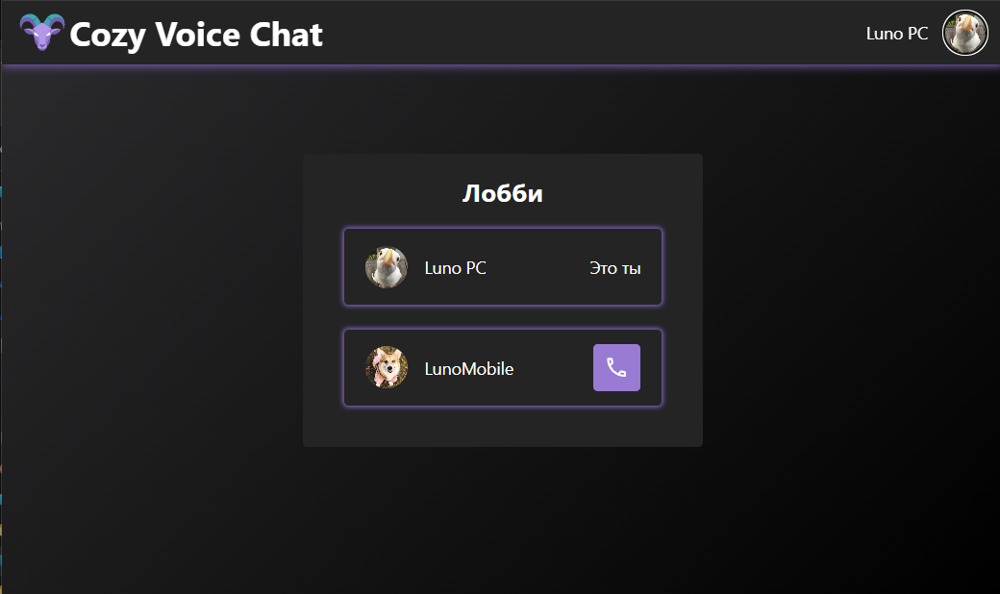
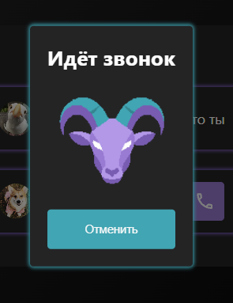
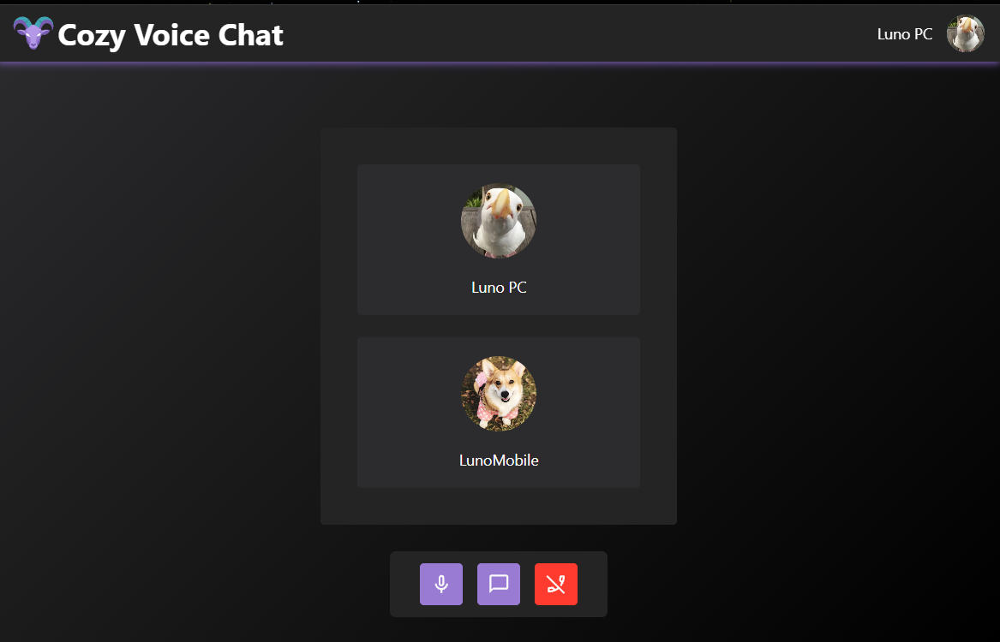
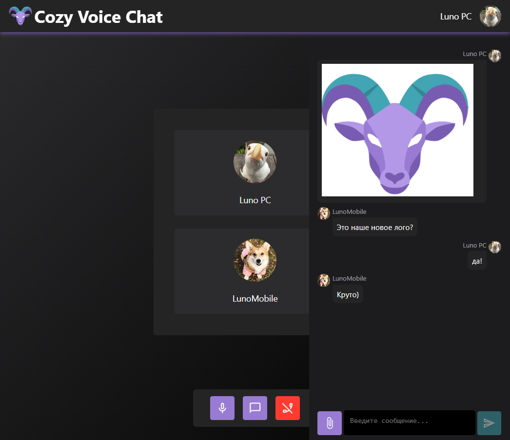

<div align="center">


# 🐐 Cozy Voice Chat

**Локальный P2P голосовой чат для созвонов по LAN**

_Нулевой пинг. Гигабитная передача файлов. Уютные звонки 1-на-1._

</div>

---

## 📖 О проекте

**Cozy Voice Chat** — это локальный голосовой чат, созданный для комфортных созвонов в локальной сети. Благодаря P2P-архитектуре (WebRTC через PeerJS) голосовой трафик идёт напрямую между участниками, обеспечивая **нулевой пинг** и минимальные задержки.

Проект родился из простой идеи: иметь свой уютный мессенджер для звонков по LAN с возможностью быстро перекидывать тяжёлые файлы на гигабитной скорости локальной сети 🚀

### ✨ Возможности

- 🎙️ **Голосовые звонки 1-на-1** через P2P (WebRTC)
- 💬 **Текстовый чат** внутри звонка
- 📎 **Обмен файлами** — файлы хранятся на машине хоста и автоматически удаляются после завершения звонка
- 🔊 **Регулировка громкости** собеседника
- 🎨 **Кастомизация профиля** — установка имени и аватарки, **Тёмная и светлая темы**
- 📱 **Полноценный мобильный адаптив**
- 🔒 **HTTPS из коробки** — для работы современных браузерных API
- 🛡️ **Безопасность** — rate limiting, CORS, helmet, валидация origins
- 🖥️ **Демонстрация экрана (Screen Sharing)**

### 🚧 В разработке
- 🎛️ Виджет управления звуком (Picture-in-Picture)

> 💡 Для Screen Sharing и PiP требуется HTTPS — браузеры блокируют `getDisplayMedia` и PiP API в небезопасном контексте.

---

## ️ Известные ограничения

Проект активно развивается, поэтому некоторые моменты пока работают неидеально:

| Проблема                             | Описание                                                                                                                                                                                   | Обходной путь                 |
| ------------------------------------ | ------------------------------------------------------------------------------------------------------------------------------------------------------------------------------------------ | ----------------------------- |
| 🟡 **Обновление профиля**            | После смены имени или аватарки изменения не отображаются у собеседника до перезагрузки страницы. Сигнал об обновлении профиля пока не реализован.                                          | Обновить страницу после смены |
| 🟡 **Хранение данных**               | Информация о пользователях хранится в `localStorage` браузера. Аватарки и имена не сохраняются на сервере.                                                                                 | —                             |

> Эти ограничения не критичны и не мешают основной функции — голосовому общению. Фикс в планах, но не в приоритете.

## 📸 Скриншоты

### Лобби

<div align="center">
  
  <p><em>Список участников локальной сети и кнопка вызова</em></p>
</div>

### Входящий звонок

<div align="center">
  
  <p><em>Модальное окно входящего вызова</em></p>
</div>

### Активный звонок

<div align="center">
  
  <p><em>Интерфейс активного звонка с участниками</em></p>
</div>

### Чат во время звонка

<div align="center">
  
  <p><em>Текстовый чат и обмен файлами прямо во время разговора</em></p>
</div>

---

## 🛠️ Технологический стек

### Frontend

- **React 19** + **TypeScript** — UI
- **Vite** — сборщик и dev-сервер
- **PeerJS** — обёртка над WebRTC для P2P-соединения
- **Emotion** — стилизация
- **react-hook-form** — формы
- **react-modal** / **react-toastify** — модалки и уведомления
- **react-router** — маршрутизация

### Backend

- **Node.js** + **Express** — HTTP-сервер
- **ws (WebSocket)** — сигнальный сервер
- **PeerJS Server** — сервер для WebRTC-сигнализации
- **multer** — загрузка файлов
- **helmet** + **cors** — безопасность
- **rate-limiter-flexible** — защита от флуда
- **winston** — логирование

---

## 🚀 Быстрый старт

### Требования

- **Node.js** 18+
- **npm** 9+
- Компьютеры в одной локальной сети

### 1. Клонирование и установка

```bash
git clone https://github.com/KulkovaAnna/cozy-voice-chat.git
cd cozy-voice-chat

# Backend
cd backend
npm install

# Frontend
cd ../frontend
npm install
```

### 2. Настройка переменных окружения

**Backend** (`backend/.env`):

```bash
cp .env.example .env
```

**Frontend** (`frontend/.env`):

```bash
cp .env.example .env
```

> ⚠️ Обязательно укажите свой локальный IP в `VITE_HOST_IP` (например, `192.168.31.231`). Узнать IP: `ipconfig` (Windows) или `ifconfig` / `ip a` (Linux/macOS).

### 3. Запуск

Вам понадобится **3 терминала**:

```bash
# Терминал 1 — Backend (сигнальный сервер)
cd backend
npm run start
# или для HTTPS-режима:
npm run start:ssl

# Терминал 2 — PeerJS сервер
cd frontend
npm run peerServer:start

# Терминал 3 — Frontend (Vite dev server)
cd frontend
npm run dev
```

### 4. Подключение клиентов

После запуска фронтенд выведет в консоль адрес вида:

```
Local:   http://localhost:5173
Network: http://192.168.31.231:5173
```

Откройте **сетевой адрес** на любом устройстве в локальной сети — и можно звонить! 📞

---

## 🔒 Настройка HTTPS

Для работы Screen Sharing и Picture-in-Picture браузеры требуют **Secure Context** (HTTPS). В проекте есть два режима сервера:

| Режим     | Команда             | Когда использовать                             |
| --------- | ------------------- | ---------------------------------------------- |
| **HTTP**  | `npm run start`     | Быстрый тест на localhost                      |
| **HTTPS** | `npm run start:ssl` | Работа в локальной сети с другими устройствами |

### Генерация SSL-сертификатов через mkcert

1. **Установите mkcert**:

   ```bash
   # Windows
   choco install mkcert

   # macOS
   brew install mkcert

   # Linux — см. https://github.com/FiloSottile/mkcert
   ```

2. **Создайте локальный CA** (один раз на машину):

   ```bash
   mkcert -install
   ```

3. **Сгенерируйте сертификат для вашего IP**:

   ```bash
   # Создайте папку cert в корне проекта
   mkdir cert
   cd cert

   # Сгенерируйте сертификат (подставьте свой IP)
   mkcert 192.168.31.231
   ```

   В папке `cert/` появятся два файла: `192.168.31.231.pem` и `192.168.31.231-key.pem`.

4. **Укажите пути в `.env`** (и backend, и frontend):

   ```env
   SSL_KEY_PATH=../cert/192.168.31.231-key.pem
   SSL_CERT_PATH=../cert/192.168.31.231.pem
   ```

5. **Доверие на клиентских машинах** (опционально):

   Если браузер на втором компьютере ругается на сертификат, скопируйте корневой CA (`mkcert -CAROOT` покажет путь) на клиентскую машину и установите его в «Доверенные корневые центры сертификации».

> 💡 **Альтернатива для PeerJS**: можно проксировать PeerJS через Vite (см. `vite.config.js` → `proxy`), тогда отдельный SSL для порта 9000 не нужен.

---

## ⚙️ Переменные окружения

### Backend (`backend/.env`)

| Переменная               | По умолчанию                                            | Описание                            |
| ------------------------ | ------------------------------------------------------- | ----------------------------------- |
| `PORT`                   | `8080`                                                  | Порт HTTP/HTTPS сервера             |
| `NODE_ENV`               | `development`                                           | Режим работы                        |
| `ALLOWED_ORIGINS`        | `http://localhost:*,http://192.168.*,https://192.168.*` | Разрешённые origins (через запятую) |
| `REQUIRE_AUTH`           | `false`                                                 | Требовать ли авторизацию            |
| `AUTH_TOKEN`             | `local_default_token`                                   | Токен для админских эндпоинтов      |
| `MAX_CONNECTIONS_PER_IP` | `5`                                                     | Лимит подключений с одного IP       |
| `MAX_MESSAGE_SIZE`       | `16384`                                                 | Макс. размер WS-сообщения (байт)    |
| `MAX_CLIENTS`            | `100`                                                   | Макс. одновременных клиентов        |
| `SSL_KEY_PATH`           | —                                                       | Путь к SSL-ключу                    |
| `SSL_CERT_PATH`          | —                                                       | Путь к SSL-сертификату              |

### Frontend (`frontend/.env`)

| Переменная       | Пример                           | Описание                          |
| ---------------- | -------------------------------- | --------------------------------- |
| `VITE_HOST_IP`   | `192.168.31.231`                 | IP хоста в локальной сети         |
| `VITE_PORT`      | `8080`                           | Порт backend сервера              |
| `VITE_PEER_PORT` | `9000`                           | Порт PeerJS сервера               |
| `SSL_KEY_PATH`   | `../cert/192.168.31.231-key.pem` | Путь к SSL-ключу (для Vite)       |
| `SSL_CERT_PATH`  | `../cert/192.168.31.231.pem`     | Путь к SSL-сертификату (для Vite) |

---

## 🗺️ Roadmap

- [x] P2P голосовые звонки 1-на-1
- [x] Текстовый чат внутри звонка
- [x] Обмен файлами
- [x] HTTPS поддержка
- [x] 🖥️ Screen Sharing (демонстрация экрана)
- [ ] 🎛️ Picture-in-Picture виджет с контролами звука

---

## 🎯 Зачем это всё?

Проект создавался для личного использования с конкретной целью — **уютные созвоны по локальной сети с нулевым пингом**. Когда у вас гигабитный роутер, а провайдер режет скорость до 100 Мбит/с, свой локальный чат — это просто спасение для передачи тяжёлых файлов и голосового общения без задержек.

Никакого облака. Никаких внешних серверов. Только вы, ваш друг и локальная сеть. 🐐

---

## 📄 Лицензия

Проект распространяется под лицензией [MIT](LICENSE). Делайте с ним что хотите — форкайте, улучшайте, используйте в своих LAN-вечеринках!

---

<div align="center">

**Сделано с 🐐 и любовью к локальным сетям**

[Сообщить о баге](https://github.com/KulkovaAnna/cozy-voice-chat/issues) · [Предложить идею](https://github.com/KulkovaAnna/cozy-voice-chat/issues)

</div>
